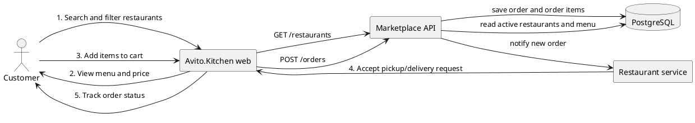
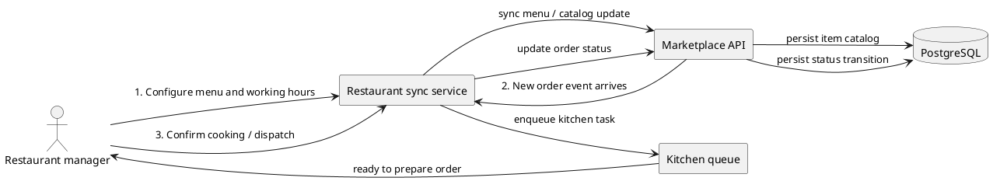

# Avito.Kitchen MVP

Avito.Kitchen is a minimal marketplace backend for food delivery MVP. The project includes:

- a marketplace API for searching restaurants, viewing menus, and creating orders
- a sample restaurant integration service that accepts order events from the main platform
- PostgreSQL-backed persistence with SQL migrations
- OpenAPI contract under `openapi/kitchen-api.yaml`

## Business scenarios

The product is designed around the most common customer flows:

1. A user opens the main page and filters restaurants by cuisine and city.
2. The user views restaurant details and menu and chooses a dish.
3. The user adds items to a cart and confirms the delivery address.
4. The marketplace creates an order and stores all items together with a customer snapshot.
5. The marketplace notifies the restaurant integration service about a new order.
6. The restaurant receives the order and can prepare it for delivery.

For restaurants, the flow is:

1. Restaurant catalog is seeded in the marketplace.
2. A new order is forwarded from the main API to the restaurant microservice.
3. The restaurant service records the incoming order in memory for demo purposes.
4. The restaurant can inspect orders through its own API and handle them as a kitchen queue.

## Architecture

### C4 context diagram

```plantuml
@startuml
!includeurl https://raw.githubusercontent.com/plantuml-stdlib/C4-PlantUML/master/C4_Context.puml
LAYOUT_WITH_LEGEND()

Person(customer, "Customer", "Searches for restaurants and orders food")
Person(manager, "Restaurant manager", "Publishes menu and handles incoming orders")
System_Boundary(avito, "Avito.Kitchen") {
    System(web, "Web app", "Marketplace frontend for ordering")
    System(api, "Kitchen API", "Marketplace backend for catalog and orders")
    System(rs, "Restaurant service", "Sample integration service for restaurant operations")
    SystemDb(db, "PostgreSQL", "Stores restaurants, menu items, customers, orders")
}

Rel(customer, web, "Browses menu and places orders")
Rel(web, api, "Uses REST API")
Rel(api, db, "Reads and writes order data")
Rel(api, rs, "Pushes new order event")
Rel(manager, rs, "Configures kitchen queue and accepts orders")
@enduml
```

### User CJM



### Restaurant CJM



## Data model and database schema

The main marketplace persists all business-critical data in PostgreSQL. The schema is intentionally compact and designed for future scale-out.

Tables:

- `restaurants` — restaurant profiles, city, cuisine, ETA, commission
- `restaurant_items` — menu catalog for each restaurant
- `customers` — customer snapshots used for order creation
- `orders` — order primitive with store, total, address, status
- `order_items` — line items and snapshots for each order

Representative relationships:

- `restaurants` to `restaurant_items`: one-to-many
- `customers` to `orders`: one-to-many
- `restaurants` to `orders`: one-to-many
- `orders` to `order_items`: one-to-many

The migration files are located in `/migrations`.

## API contract

The OpenAPI document is stored at `openapi/kitchen-api.yaml`.

Main endpoints:

- `GET /api/v1/restaurants`
- `GET /api/v1/restaurants/{restaurantId}`
- `GET /api/v1/restaurants/{restaurantId}/menu`
- `GET /api/v1/orders`
- `POST /api/v1/orders`
- `GET /api/v1/orders/{orderId}`
- `GET /api/v1/healthz`

## Example startup

Requirements:

- Docker
- Docker Compose

Run:

```bash
docker compose up --build
```

Then check:

- main API: http://localhost:8080/api/v1/restaurants
- restaurant service: http://localhost:8081/api/v1/orders
- Postgres: localhost:5432

Example requests:

```bash
curl http://localhost:8080/api/v1/restaurants
curl http://localhost:8080/api/v1/restaurants/1/menu
curl -X POST http://localhost:8080/api/v1/orders \
  -H 'Content-Type: application/json' \
  -d '{
    "customer": {"display_name": "Иван Петров", "phone": "+79001234567"},
    "restaurant_id": 1,
    "delivery_address": "Москва, ул. Лесная, 22",
    "notes": "Без лука",
    "items": [{"item_id": 1, "quantity": 2}, {"item_id": 2, "quantity": 1}]
  }'
```

## Project prompt plan

Prompt summary used to shape the implementation:

> Build an MVP food-delivery marketplace with a main API, PostgreSQL persistence, and a sample restaurant integration service. Focus on restaurant discovery, menu reading, order creation, and restaurant notification. Keep the solution lightweight and production-appropriate for a demo, but make the architecture extensible for future scale-out.

## Simplifications and future extensions

This MVP intentionally keeps some responsibilities lightweight for demonstration purposes:

- no real user authentication or authorization is implemented
- restaurant integration is a demo HTTP webhook service using in-memory state
- order status transitions are simplified and stored in a single `orders.status` field
- there is no payment service or delivery assignment service yet

These tradeoffs keep the project easy to run in Docker Compose while preserving a clean path to future service decomposition.
